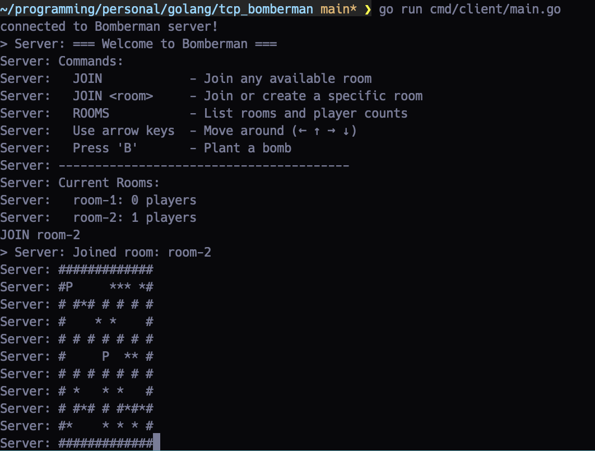

# 💣 TCP Bomberman

A terminal-based multiplayer Bomberman-style game built with Go and raw TCP sockets. Connect, compete, and outwit opponents by strategically planting bombs and navigating a destructible arena — all from your terminal.



---

## 🎮 Features

- Multiplayer gameplay over raw TCP (no HTTP or WebSockets)
- Dynamic maps with destructible blocks
- Player movement via arrow keys
- Bomb planting with timed explosions
- Auto-balanced or manual room joining
- Clean, thread-safe server architecture

---

## 🛠️ Installation & Usage

### Prerequisites

- Go 1.20 or higher installed ([golang.org/dl/](https://golang.org/dl/))
- Terminal with ANSI escape sequence support (e.g., xterm, GNOME Terminal)

### Clone the Repository

```bash
git clone https://github.com/your-username/tcp-bomberman.git
cd tcp-bomberman
```

### Build the Server and Client

```bash
make build-server   # Builds the server binary to ./build/server.exe
make build-client   # Builds the client binary to ./build/client.exe
```

### Run the Server and Client

```bash
./build/server.exe
./build/client.exe
```

Alternatively, you can run the server and client directly using the Makefile targets:

```bash
make run-server     # Runs the server
make run-client     # Runs the client
```


